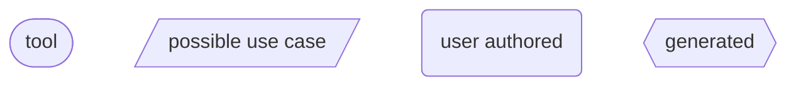
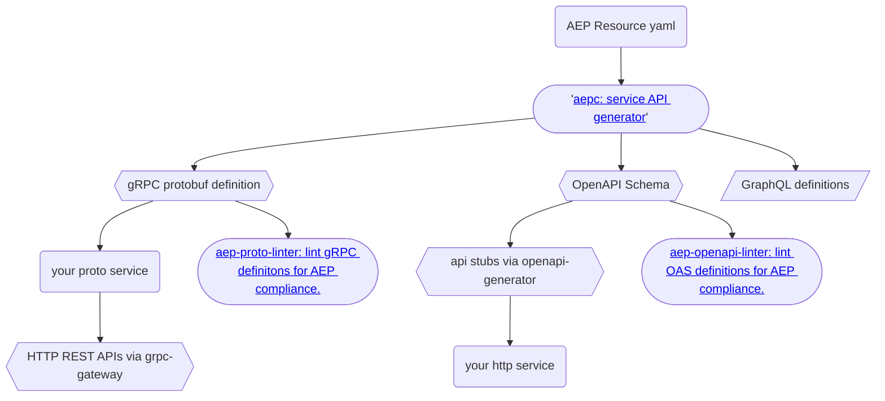
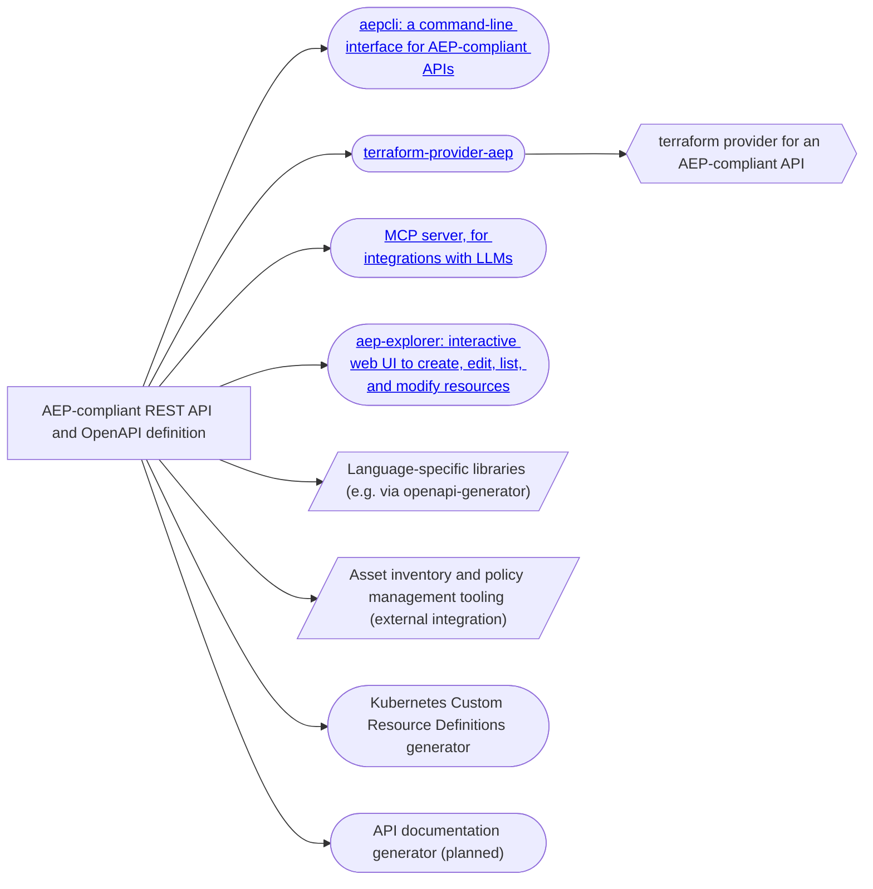

# Tooling and Ecosystem

In addition to an API design specification, AEPs also provide an ecosystem of
tooling to help produce and interact with these APIs.

## Diagram

The following is a diagram that illustrates an end-to-end workflow, including
nodes of tooling that exists, or is intended to be created for the project.

Some of the tools in the diagram are not maintained by the AEP project. The
diagram is intended to be a complete representation of tools available to help
a user understand how the tools fit in to a development workflow.

The service generation tooling looks like:

While the client tooling for an AEP-compliant compatible API includes:

